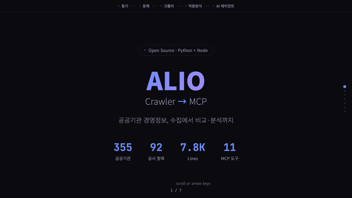

# alio-mcp

[](https://giovinazo.github.io/alio-mcp)

> **[소개 페이지 보기](https://giovinazo.github.io/alio-mcp)**

한국 공공기관 정보공개시스템 **알리오(ALIO, [www.alio.go.kr](https://www.alio.go.kr))** 의 항목별공시 데이터를 LLM 도구로 노출하는 MCP(Model Context Protocol) 서버.

GUI 크롤러는 *사람이* 알리오를 쓰게 해주고, 이 MCP 서버는 *AI 에이전트가* 알리오를 쓰게 해준다.

### 지금 바로 시작하기 — `.mcpb` 더블클릭 (권장)

1. **[Claude Desktop](https://claude.ai/download)** 설치 (이미 있으면 건너뛰기)
2. **[최신 릴리스](https://github.com/giovinazo/alio-mcp/releases/latest)** 에서 **`alio-mcp.mcpb`** 다운로드
3. 받은 `.mcpb` 파일을 **더블클릭** → Claude Desktop 확장(Extensions) 설치 창에서 **설치** 클릭
4. 끝. 대화창에서 *"산단공 내부규정 찾아줘"* 처럼 물어보세요.

> **Python·터미널·설정 파일 편집이 전혀 필요 없습니다.** `.mcpb`(MCP Bundle, 구 DXT)에 Node 서버가 단일 파일로 번들되어 더블클릭만으로 설치·삭제됩니다. — *Node/TypeScript 포팅 `node/`, v1.0.0*

<details>
<summary><b>개발자·다른 방식 설치</b> (Python 소스 / ZIP / 수동 등록)</summary>

- **ZIP + Claude 안내**: [Download ZIP](https://github.com/giovinazo/alio-mcp/archive/refs/heads/main.zip) → Claude Desktop 대화에 ZIP을 올리고 *"이거 설치 도와줘"* → Claude가 환경(Mac/Windows)에 맞게 단계별 안내.
- **Python 직접 등록 / Claude Code(CLI)**: 아래 [직접 설치 (개발자용)](#직접-설치-개발자용) 참고.
- **`.mcpb` 직접 빌드**: `cd node && npm install && npm run build && npx @anthropic-ai/mcpb pack . alio-mcp.mcpb`
</details>

## 무엇을 하는가

알리오 항목별공시는 약 355개 공공기관이 의무적으로 공시하는 92개 표준화된 정보 메뉴다(임직원 수·임원연봉·신규채용 현황·이사회·자체 감사부서·임원 모집공고·감사원 지적사항 등). 이 MCP는 그 데이터를 LLM이 자연어로 직접 다룰 수 있게 한다.

> *예* — "산단공이랑 정원 비슷한 기관 5곳 임직원수 비교해줘", "최근 30일 임원 모집공고를 부처별로 정리해줘", "산단공 감사원 지적사항 첨부 PDF 다 받아줘"

## 아키텍처

**Python·Node 두 런타임으로 동일한 17개 도구를 제공한다.** Node판(`node/`)은 Python을 1:1 포팅(도구별 동등성 적대 검증 완료)해 **MCPB 번들(`.mcpb`)** 로 패키징 — Claude Desktop 더블클릭 설치용이며, esbuild 단일 번들이라 Node 외 의존성이 없다.

이 패키지의 `alio_core.py`는 알리오 API 호출·HTML 파싱·파일 다운로드를 담당하는 **공유 라이브러리(정본)**다. GUI 크롤러([alio-crawler](https://github.com/giovinazo/alio-crawler))는 자기 레포에 이 파일의 **sync된 사본**을 보유하며, 두 프로젝트가 동일 코어로 동작한다.

**동기화 절차** (alio_core.py 수정 후):
```bash
./sync_to_crawler.sh   # 형제 폴더 "1. 알리오 크롤러"로 cp
# 또는 다른 위치:
CRAWLER_DIR=/path/to/alio-crawler ./sync_to_crawler.sh
```

본 레포 단독으로 MCP 서버 실행에 알리오-크롤러는 필요 없다.

## 제공 도구 (v1.4.0 — 17개)

> 아래는 대표 도구 상세입니다. **전체 17개 도구의 입력·반환은 `node/manifest.json`과 각 도구 docstring**을 참조하세요.
> v0.6.0+ 추가분: `get_report_data`(보고서 본문 표·평문), `get_organ_profile`(기관장·홈페이지·예산 등 프로필),
> `compare_organs`(다중 기관 본문 병렬 비교), `get_structured_summary`(징계종류·청렴도 정형 집계), `list_menus_tree`(메뉴 계층 트리).

| # | 도구 | 도입 | 용도 |
|---|---|---|---|
| 1 | `list_menus` | v0.1.0 | 메뉴 92개 (v0.5.0 `keyword` 항목명 검색 추가) |
| 2 | `list_organs` | v0.2.0 | 메뉴별 기관 ~355개 |
| 3 | `list_board_items` | v0.2.0 | 게시판형 자료 1페이지 |
| 4 | `download_report` | v0.2.0 | 공시 PDF |
| 5 | `search_organs` | v0.3.0 | 기관명 부분 일치 |
| 6 | `list_board_attachments` | v0.3.0 | 게시판형 첨부 메타 |
| 7 | `download_board_attachment` | v0.3.0 | 게시판형 첨부 다운로드 |
| 8 | `list_all_board_items` | **v0.4.0** | 전체 페이지 자동 순회 (v0.5.0 apbaId 필수 rootNo 힌트 개선) |
| 9 | `list_disclosure_attachments` | **v1.4.0** | 보고서형 부속 첨부 목록(fileNo·fileName·submissionNo) — `download_disclosure_attachment` 진입점 |
| 9b | `download_disclosure_attachment` | **v0.4.0** | 보고서 부속 첨부 file·dfile |
| 10 | `list_rules` | **v0.4.1** | 기관 내부규정 목록 + 최신 파일 메타 (v0.4.1 `count_only`·`include_files` 경량 옵션) |
| 11 | `download_rule_file` | **v0.4.0** | 내부규정 파일 fileNo 다운로드 |


### 1. `list_menus(category="", keyword="")`

알리오 항목별공시 메뉴 92개 목록 조회 (v5.4.2 기준 — ESG 운영·AI 활용 카테고리 신설 반영).

**인자**
- `category` *(string, optional)* — 대분류명. 허용값: `"기관운영"` / `"ESG 운영"` / `"경영성과"` / `"대내외 평가 등"` / `"AI 활용"`
  - 공백·대소문자 차이 자동 흡수 (`"esg운영"`도 매칭)
  - 빈 문자열이면 대분류 필터 없음
- `keyword` *(string, optional, v0.5.0)* — 항목명 부분 일치 검색 (예: `"감사"`, `"자체감사"`, `"징계"`)
  - `category`와 동시 사용 가능 (AND 조건)
  - 빈 문자열이면 키워드 필터 없음

**반환 예**
```json
[
  {"대분류": "기관운영", "항목명": "임직원 수", "rootNo": "20201,20202,20203,20204", "보고서형": true},
  {"대분류": "기관운영", "항목명": "임원 모집공고", "rootNo": "B1010", "보고서형": false}
]
```

### 2. `list_organs(rootNo, page=1)`

특정 메뉴(rootNo)에 공시하는 약 355개 기관 목록 조회.

**인자**
- `rootNo` *(string, required)* — 메뉴 식별자 (예: `"10105"` 일반현황, `"B1010"` 임원 모집공고)
  - 콤마 묶음(`"20201,20202,20203,20204"`)은 자동으로 첫 항목만 사용
- `page` *(int, optional, 기본 1)* — 페이지 번호

**반환 예**
```json
{
  "totalCnt": 344,
  "page": 1,
  "기관": [
    {
      "기관ID": "C0208", "기관명": "한국산업단지공단",
      "기관유형": "준정부기관(위탁집행형)", "주무부처": "산업통상부",
      "기준연도": "2025", "기준분기": null,
      "공시번호": null, "제출번호": null
    }
  ]
}
```

### 3. `list_board_items(rootNo, apbaId="", page=1)`

게시판형 12종 항목(B1010 임원 모집공고·B1020 직원 채용·B1030 입찰공고·B1210 국회 외부평가·B1220 감사원 지적사항 등)의 자료 목록 조회.

**인자**
- `rootNo` *(string, required)* — 게시판형 항목 (예: `"B1010"`)
- `apbaId` *(string, optional)* — 특정 기관 ID로 한정 (`"C0208"` 한국산업단지공단). 빈 문자열이면 전체 기관
- `page` *(int, optional, 기본 1)*

**반환 예**
```json
{
  "rootNo": "B1010", "page": 1,
  "자료": [
    {
      "제목": "한국산업단지공단 비상임감사 모집공고",
      "등록일": "2026.03.19",
      "기관ID": "C0208",
      "공시번호": "2026031903132783",
      "제출번호": "2026031910347384",
      "idx": "3502813",
      "reportFormNo": "B1010"
    }
  ]
}
```

### 4. `download_report(disclosureNo, save_dir="~/Downloads/alio", filename="")`

공시번호로 보고서 PDF 다운로드.

**인자**
- `disclosureNo` *(string, required)* — `list_organs` 또는 `list_board_items` 응답의 *공시번호*
- `save_dir` *(string, optional)* — 저장 디렉토리 (없으면 자동 생성)
- `filename` *(string, optional)* — 저장 파일명. 빈 문자열이면 `alio_{disclosureNo}.pdf`

**반환 예**
```json
{
  "saved_path": "~/Downloads/alio/alio_2025101403058502.pdf",
  "size_bytes": 90291,
  "content_type": "application/pdf"
}
```

### 5. `search_organs(name)` *(v0.3.0 신규)*

공공기관 약 355개 중 기관명 부분 일치 검색.

**인자**
- `name` *(string, required)* — 검색 키워드 (부분 문자열). 예: `"산업단지"`, `"한국전력"`

**반환 예**
```json
{
  "총_검색결과": 1,
  "기관": [
    {"기관ID": "C0208", "기관명": "한국산업단지공단",
     "기관유형": "준정부기관(위탁집행형)", "주무부처": "산업통상부", "지역": "대구광역시"}
  ]
}
```

첫 호출 시 알리오 기관목록 API를 1회 호출해 캐시. 상위 50건 반환.

### 6. `list_board_attachments(apbaId, reportFormNo, idx, disclosureNo, ...)` *(v0.3.0 신규)*

게시판형 자료의 첨부파일·외부링크 메타 추출 (`itemBoard{reportFormNo}.do` HTML 파싱).

감사원 지적사항(B1220)·국회 외부평가(B1210)·임원 모집공고(B1010)·직원 채용(B1020) 등에서 첨부 PDF/HWP 메타를 얻는다.

**인자** (모두 `list_board_items` 응답에서 그대로 전달)
- `apbaId` *(string, required)* — 기관ID
- `reportFormNo` *(string, required)* — 게시판 항목 코드
- `idx`, `disclosureNo`, `tableName`, `idxName`, `bidType` *(string, optional)*

**반환 예**
```json
{
  "첨부": [
    {"kind": "upload", "name": "2025년도 산업통상자원부 종합감사 결과.pdf",
     "spath": "/2025/...", "sfile": "abc.pdf", "file_no": ""}
  ],
  "외부링크": [{"url": "https://www.g2b.go.kr/...", "text": "나라장터 입찰공고"}]
}
```

두 가지 첨부 패턴 통합:
- `kind="upload"`: `/upload{spath}{sfile}` 직접 GET (감사원/국회 지적사항)
- `kind="fileno"`: `/download/download.json?fileNo=N` GET (임원 모집공고·직원 채용)

### 7. `download_board_attachment(kind, name, spath, sfile, file_no, save_dir)` *(v0.3.0 신규)*

게시판형 첨부파일 다운로드. `list_board_attachments` 응답의 `첨부` 항목 필드를 그대로 전달.

**인자**
- `kind` *(string, required)* — `"upload"` 또는 `"fileno"`
- `name` *(string, optional)* — 저장 파일명
- `spath`, `sfile` *(string)* — `kind="upload"`일 때
- `file_no` *(string)* — `kind="fileno"`일 때
- `save_dir` *(string, optional, 기본 `~/Downloads/alio`)*

**반환 예**
```json
{
  "saved_path": "~/Downloads/alio/2025년도 산업통상자원부 종합감사 결과.pdf",
  "size_bytes": 75824
}
```

매칭 실패 또는 인자 누락 시 모두 `{"error": "..."}` 시그널 반환 (NOT_FOUND·MISSING·HTTP·API_ERROR·DOWNLOAD_FAILED).

## 시작하기

### 가장 쉬운 방법 (터미널 몰라도 됨)

1. 이 페이지 상단의 **`<> Code`** → **`Download ZIP`** 클릭
2. [Claude Desktop](https://claude.ai/download) 설치 (이미 있으면 건너뛰기)
3. Claude Desktop 대화에 다운로드한 **ZIP 파일을 그대로 올리기**
4. **"이거 설치 도와줘"** 라고 입력

Claude가 ZIP 안의 코드와 문서를 읽고, 사용자 환경(Mac/Windows)에 맞게 설치를 단계별로 안내해 줍니다.

---

### 직접 설치 (개발자용)

MCP 서버는 단독 프로그램이 아니라 Claude에 붙이는 **확장 도구**다.

#### 선행 조건

| 항목 | 설명 |
|------|------|
| Claude 구독 | Claude Pro($20/월) 이상, 또는 Anthropic API 키 |
| Python | 3.10 이상 (`python3 --version`으로 확인) |
| Claude 클라이언트 | **Claude Desktop** (GUI) 또는 **Claude Code** (CLI, `npm install -g @anthropic-ai/claude-code`) |

> Claude Desktop은 [claude.ai/download](https://claude.ai/download)에서 받을 수 있다.
> Claude Code는 Node.js 18+ 필요 → `npm install -g @anthropic-ai/claude-code`로 설치.

#### 1단계: 레포 클론 & 패키지 설치

```bash
git clone https://github.com/giovinazo/alio-mcp.git
cd alio-mcp
pip install -r requirements.txt
```

#### 2단계: Claude에 MCP 서버 등록

사용하는 클라이언트에 따라 **하나만** 선택한다.

#### 방법 A — Claude Desktop (GUI 사용자)

설정 파일을 열어 `mcpServers`에 추가한다.

- **macOS**: `~/Library/Application Support/Claude/claude_desktop_config.json`
- **Windows**: `%APPDATA%\Claude\claude_desktop_config.json`

```json
{
  "mcpServers": {
    "alio": {
      "type": "stdio",
      "command": "python3",
      "args": ["/absolute/path/to/alio-mcp/alio_mcp.py"]
    }
  }
}
```

> `/absolute/path/to/`를 실제 클론 경로로 바꿔야 한다. 예: `/Users/username/alio-mcp/alio_mcp.py`

설정 후 Claude Desktop을 **재시작**하면 도구 아이콘(망치 모양)에 `alio` 서버가 표시된다.

#### 방법 B — Claude Code (CLI 사용자)

```bash
# 프로젝트 설정 (.claude/settings.local.json)에 추가
claude mcp add alio -- python3 /absolute/path/to/alio-mcp/alio_mcp.py
```

또는 `~/.claude/settings.local.json`을 직접 편집:

```json
{
  "mcpServers": {
    "alio": {
      "type": "stdio",
      "command": "python3",
      "args": ["/absolute/path/to/alio-mcp/alio_mcp.py"]
    }
  }
}
```

#### 3단계: 동작 확인

Claude에게 자연어로 물어본다:

```
"알리오 메뉴 목록 보여줘"
```

92개 메뉴가 표 형태로 나오면 성공이다.

### 4단계 (선택): 에이전트 설정 — Claude Code 전용

에이전트는 MCP 도구를 **자율적으로 조합**해 복잡한 수집 작업을 처리하는 서브에이전트다.
Claude Code에서만 사용 가능하며, Claude Desktop에서는 지원하지 않는다.

```bash
# 에이전트 정의 파일을 Claude Code 에이전트 폴더에 복사
mkdir -p ~/.claude/agents
cp agents/alio-investigator.md ~/.claude/agents/
```

설정 후 Claude Code가 알리오 데이터 수집 작업을 위임할 때 자동으로 이 에이전트를 사용한다.

> **에이전트가 할 수 있는 것**: 다수 기관·다수 항목 일괄 수집, 기관별 비교, CSV 인덱스 작성
>
> **에이전트가 할 수 없는 것**: 법령 해석, PDF 텍스트 추출, 보고서 작성 (메인 Claude에 재위임)

### 단계별 추천

| 수준 | 추천 |
|------|------|
| AI 처음 써봄 | 먼저 [알리오 크롤러(GUI)](https://github.com/giovinazo/alio-crawler)를 써보세요 |
| Claude 쓸 줄 앎 | **방법 A** (Claude Desktop + MCP) — 자연어로 조회·다운로드 |
| 터미널 익숙함 | **방법 B** (Claude Code + 에이전트) — 대량 수집·자동화 |

전체 설정 예시는 [`examples/`](./examples) 폴더 참조.

## 사용 예시

Claude에서 자연어 한 줄로:

| 질의 | 동원되는 도구 |
|---|---|
| "기관운영 대분류 메뉴 보여줘" | `list_menus("기관운영")` |
| "산단공 기관ID 찾아줘" | `search_organs("산업단지공단")` |
| "한국산업단지공단의 일반현황 공시번호 찾아줘" | `list_organs("10105")` → apbaId 필터링 |
| "산단공 최근 감사원 지적사항 가져와" | `list_board_items("B1220", "C0208")` |
| "그 자료 첨부 PDF 다 받아줘" | `list_board_attachments(...)` → `download_board_attachment(...)` × N |
| "산단공 비상임감사 모집공고 PDF 받아줘" | `list_board_items("B1010", "C0208")` → `download_report(disclosureNo)` |
| "산단공 자체감사 결과 다 가져와" *(v0.4.0)* | `list_all_board_items("43006", "C0208")` — 79건 일괄 |
| "산단공 정관 최신 HWP 받아줘" *(v0.4.0)* | `list_rules("한국산업단지공단", "K1500")` → `download_rule_file(fileNo)` |
| "위탁집행형 준정부기관 49곳 규정 수 집계해줘" *(v0.4.1)* | 기관별 `list_rules(instName, count_only=True)` × 49 (HTTP 49회) |
| "산단공 정관 제목만 다 보여줘" *(v0.4.1)* | `list_rules("한국산업단지공단", "K1500", include_files=False)` |

## 데이터 출처 / API 참고

알리오 사이트의 비공식 내부 API를 사용한다.

| 엔드포인트 | 용도 | 사용 도구 |
|---|---|---|
| `POST /item/formList.json` | 83개 메뉴 일괄 조회 | `list_menus` |
| `POST /item/itemOrganListJung.json` | 메뉴별 기관 목록 (344개) | `list_organs` |
| `POST /item/itemReportListSusi.json` | 게시판형 자료 목록 | `list_board_items` |
| `GET /download/pdf.json` | 보고서 PDF 다운로드 | `download_report` |

| `GET /item/itemBoard{rfn}.do` (HTML 파싱) | 게시판형 첨부·외부링크 메타 추출 | `list_board_attachments` |
| `GET /upload{spath}{sfile}` | 게시판형 첨부 (패턴 A) | `download_board_attachment` |
| `GET /download/download.json?fileNo=N` | 게시판형 첨부 (패턴 B) | `download_board_attachment` |
| `POST /organ/findOrganApbaList.json` | 공공기관 전체 목록 (지역 포함) | `search_organs` |

보고서형 부속 첨부(`file.json`)·안전경영책임보고서(`dfile.json`)·내부규정(`rulefiledown.json`)은 v0.4.0에서 도구로 추가 완료.

## 라이선스

[MIT](./LICENSE)

알리오에 공시되는 데이터 자체는 **공공누리 또는 공공데이터법**에 따른 공공기관 데이터로, 본 도구는 단순한 접근 인터페이스를 제공한다.

## 만든 이유

자체감사 업무 중 타 공공기관 벤치마킹·정원 비교·감사부서 현황 비교가 빈번한데, 매번 알리오 사이트에서 항목·기관·분기를 일일이 찾아 PDF를 다운로드해 표로 정리하는 작업이 비효율적이었다. AI 에이전트가 직접 알리오 데이터를 다룰 수 있다면 자연어 한 줄로 끝나리라는 가설을 검증하기 위해 만들었다.

## 변경 이력

- **v1.4.0** (2026-05-31) — 위탁집행형 준정부기관 49개 × 전 공시항목(92개) 전수 스트레스 테스트(4,516셀, 첨부 8,139건 6.8GB 수집) 결과 반영. ① 신규 도구 `list_disclosure_attachments`(총 17개) — `itemReportFiles.json`로 보고서형 부속 첨부의 `fileNo`/`fileName`/`submissionNo`를 노출. 종전엔 `list_organs`가 이 메타를 안 줘서 `download_disclosure_attachment`의 부속 첨부(감사보고서·손익계산서·안전경영책임보고서 등)를 **도구만으로는 받을 수 없던 갭**을 해소. ② 다운로드 견고화 — 본문 스트리밍 중 끊김(ConnectionReset·ReadTimeout)을 재시도하지 않아 동시성 부하에서 간헐 실패하던 `download_file_to_path`를 요청+스트리밍 전체 재시도 + `.part` 원자적 교체로 재작성(재실행 시 transient 실패 9→0). 재시도는 외부 루프로 일원화(이중 재시도 곱셈 제거). Py↔Node 동등(self_check 26·test_client 23 FAIL0).
- **v1.3.0** (2026-05-31) — 도구 4종 추가(총 16개): `list_menus_tree`(메뉴 계층 트리), `get_organ_profile`(기관장·홈페이지·예산 등 프로필), `compare_organs`(다중 기관 본문 병렬 비교), `get_structured_summary`(징계종류별 건수·청렴도 연도별 등급 정형 집계). 크롤러 이용사례 대비 단건 위주 한계 보완.
- **v1.2.0** (2026-05-31) — 다운로드 저장경로 크로스플랫폼화(`~/Downloads/alio`, 환경변수·manifest `user_config`), UX 개선(인자 출처 안내·`truncated`·에러 `hint`·`list_rules` 경량 기본). 헤드리스 전수검증 `headless_audit.py` 신설(92항목×4엔드포인트 FAILURE 0).
- **v1.1.0** (2026-05-30) — `search_organs` 지역·유형 AND 필터, `get_report_data`(보고서 본문을 표·평문으로 반환, PDF/HWP 우회) 추가.
- **v1.0.0** (2026-05-30) — **Node/TypeScript 포팅(`node/`) + MCPB(`.mcpb`) 배포.** Claude Desktop 더블클릭 한 번으로 설치(Python·터미널·설정 파일 편집 불필요). 도구 11개 Python↔TS 동등성 적대 검증 통과(critical 0). 번들 엔트리는 `.mjs`로 두어 Node 18+ 모든 환경에서 ESM 실행 보장. 기존 Python 코어(`alio_core.py`)·alio-crawler 공유 구조는 그대로 유지.
- **v0.4.1** (2026-05-21) — `list_rules` 경량 옵션 2종 추가. `count_only=True`는 findRuleList 1페이지만 호출해 `totalCnt`만 반환(다수 기관 카운트 집계용, HTTP 1회). `include_files=False`는 findRuleDtl 호출을 생략(파일 메타 없이 제목·seq만, HTTP 호출은 페이지 수만큼). 기존 풀스펙 동작은 기본값 유지(하위호환). 한국국토정보공사 158건 기준 174회 → 1회(`count_only`) / 16회(`include_files=False`).
- **v0.4.0** (2026-05-19) — 도구 4종 추가: `list_all_board_items` (페이지 자동 순회로 audit·mgmt_eval·감사원 등 통합 처리), `download_disclosure_attachment` (보고서 부속 file·dfile), `list_rules` + `download_rule_file` (내부규정 체인 — findRuleList → findRuleDtl → rulefiledown). `self_check.py` 신설 (11개 도구 라이브 점검, PASS=12/13).
- **v0.3.0** (2026-05-19) — `alio_core.py` 도입(alio-crawler v5.4 다운로드 코어 공유). 도구 3종 추가 (`search_organs`, `list_board_attachments`, `download_board_attachment`). 메뉴 수 83→92개 (ESG 운영·AI 활용 카테고리 신설). 기관 수 344→355개.
- **v0.2.0** (2026-04-28) — 도구 3종 추가 (`list_organs`, `list_board_items`, `download_report`)
- **v0.1.0** (2026-04-27) — 초기 공개. `list_menus` 단일 도구.

## 후속 계획

- [x] ~~`download_disclosure_attachment` (file·dfile)~~ (v0.4.0 완료)
- [x] ~~`download_rule_file` 체인~~ (v0.4.0 완료)
- [x] ~~`download_board_attachment`, `search_organs`~~ (v0.3.0 완료)
- [ ] 입찰공고(B1030) 외부링크 일괄 추출 도구 (현재는 `list_board_attachments`의 `외부링크` 필드로 노출)
- [ ] alio 사이트 패턴 변동 자동 감지·알림 (cron + diff)

---

**English summary**: MCP server exposing the disclosure data of ~355 Korean public institutions via ALIO (alio.go.kr). 17 tools covering menu/institution lookup, board-type items, report PDF download, disclosure attachment listing/download, internal regulations, and file attachments. Includes a Claude Code sub-agent definition (`agents/alio-investigator.md`) for autonomous bulk data collection. v1.0.0 — also distributed as a one-click `.mcpb` bundle (Node/TypeScript port, esbuild single-file) installable in Claude Desktop by double-click.
